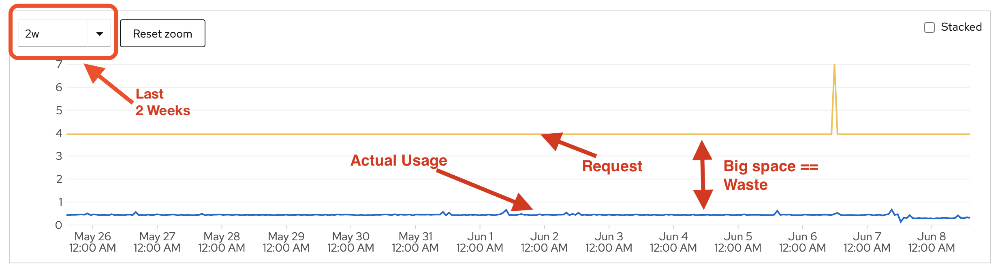
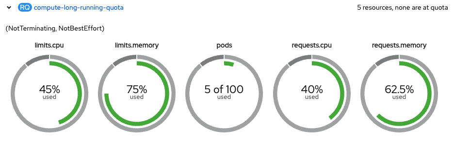

<style>
  code {
    white-space : pre-wrap !important;
    word-break: break-word;
  }
</style>

# Quota Approval Process

# TL;DR 

On our OpenShift Clusters teams generally use Memory and Disk storage responsibly. That is, they use what they ask for. When it comes to CPU, however, teams are far less optimized and need support to get back into alignment with our best practices. 

Generally, teams misuse CPU for a few key reasons: 

1. They misunderstand where to allocate CPU to make their app performant. If this is the case, they allocate too much to `request.cpu` thinking that will improve application performance - it does not. The only way to make an app performant is to increase `limit.cpu`. 

2. They misunderstand what CPU is. Teams misunderstand how CPU works on Linux and Kubernetes. It's thought of as a "buff" making the CPU they have more powerful so it can do more work. It provides more time to do the work it needs to. 

3. Building on #2 above they misunderstand how this applies to multithreaded applications, notably those written in .NET or Java.

4. They architected the application VMs. It vertically scales (one pod that does a lot) rather than horizontally scales (logs of small pods with a Horizontal Pod Autoscaller (HPA)). 

To help teams, the first step is to understand the problem ourselves then help them by first educating and then providing clear steps they can follow for corrective action. 

# Get the Facts 

Start by running a PromQL against the namespace or project to gauge if the project is using resources very well, reasonably well, poorly, etc. This will help you decide whether to rubber stamp the request or if it needs further consideration. 

## Slack 

Slack is the difference between what the deployments ask for and what the containers use. In the image below the "big space" is "slack".



An analogy I often use with teams is an "all you can eat buffet". When a deployment requests substantially more resources than it uses its analogous to a person filling a heaping plate at a buffet but only eating one or two bytes :smiling_face_with_smiling_eyes_and_hand_covering_mouth: of food. What is left on the plate becomes food waste as it cannot go back on the buffet. Likewise, no other project can utilize the waisted resources they have tied up as slack - it's wasted. 

The PromQL below will sum up request, limit, and usage for an entire project or namespace. See the pro-tip below on how to change it in meaningful ways. 

```promql! 
sum({__name__=~"namespace_cpu:kube_pod_container_resource_requests:sum|namespace:container_cpu_usage:sum|namespace_cpu:kube_pod_container_resource_limits:sum", namespace=~"fc726a-.*"} offset 1d) BY (__name__)
``` 

| Metric | Value | 
| -------- | -------- | 
| namespace:container_cpu_usage:sum | 0.066 | 
| namespace_cpu:kube_pod_container_resource_limits:sum | 35.5 | 
| namespace_cpu:kube_pod_container_resource_requests:sum | 14.95 | 

Divide the `container_cpu_usage` and `kube_pod_container_resource_requests` to determine what the namespace or project set is using as a percentage. In this case, its `0.066 / 14.95 * 100 = 44%`. We recommend on all our clusters teams **target 80% utilization**.

🤓 Pro-Tip:

1. Don't do anything that costs you more than its worth: If a team is using 10% but only waisting 30m its often not worth the effort to improve utilization;
2. Use `fc726a-dev` as the namespace 
to isolate and look at an individual namespace in the PromQL example above;
3. Use `offset 1w` or `offset 2w` to see how the namespace or project has used quota over the past 1 week or 2 weeks respectively.


## Throttling 

Once the problem is understood you can dig deeper as needed. The following PromQL will check to see if any of the pods are experiencing CPU **throttling**. Throttling is when a container does not have the time (remember, we're on a time-share system) to complete its work in the time allocated (default on k8s is 100/ms blocks).

In the query below `container_cpu_cfs_throttled_periods_total` is the total number of 100ms blocks of time the container has been given since it started. The other parameter `container_cpu_cfs_periods_total` is the number of those blocks of time where the container needed more time to complete its work. They are being summed and divided to get the total values for the given namespace as a percentage.

```promql! 
avg(container_cpu_cfs_throttled_periods_total / container_cpu_cfs_periods_total {namespace=~"fc726a-.*", pod=~".*", container_name!="POD", image!=""}) BY (namespace)
```

| Metric | Value | 
| -------- | -------- | 
| fc726a-dev | 0.013 | 
| fc726a-test | 0.037 | 
| fc726a-prod | 0.055 |

In the case of fc726a-prod, the average container did not have enough time to do all its work about 5% of the time. Its not uncommon for this value to be >0%, and low values are reasonable, but as values creep up towards past 10% (heuristic value) it tends to imply a problem with improperly set limits (remember, only limit directly impacts performance) which may require additional quota.

🤓 Pro-Tip:

1. Use `fc726a-dev` to isolate and look at an individual namespace in the PromQL example above;
2. Change the `pod` parameter regex to identify a specific group of pods like `patroni.*`;
3. A namespace won't show up if it has no data. 

## Existing Quota

Once "slack" and "throttling" are understood it is beneficial to check out how the namespace is utilizing exiting quota. In the image below, if this project were asking for additional CPU quota it is worth asking further questions to understand why the team believes additional resources are required. 



## Deployments

The section above on **slack** and **throttling** provide enough information to go digging for some useful suggestions to the team. The next step is to look through Deployments and StatefulSets to see if any pro-tips can be given to the teams. Generally, look for any specific advice such as:

* Do **not** allocate more that 1,000m (1-core) unless the app is multithreaded or a scientific process that crunches data or trains a machine learning (ML) model. See [this](https://www.youtube.com/watch?v=xjpHggHKm78) on Kubernetes best practices on the subject; 
* When `request.cpu` is too high in creates "slack";
* When `limut.cpu` is too low teams may experience throttling and think they need more quota; 
* Does the app scale vertically: no Horizontal Pod Autoscaller (HPA) and high `limit.cpu`, or horizontally: has an HPA and well set `request.cpu`.

# Evaluation

Once your analysis is completed you can either approve the quota request because resources are being used well enough, or because there is not much to be gained by further optimization. If you feel the request for quota is unnecessary:

Email the technical contacts and Cc the Po with an email outlining your thoughts such as:

<code>
  Subject: Quota Request for ABC Forms Improvement Project. 

  Hi, 

  I've had a look at your request for quota in the abc123-dev namespace. Before we can proceed with additional quota, we need the existing project to better utilize the resources it has. Here are few ideas to help: 

  Your Patroni pods have a `request.cpu` value of 500m but only use 10m. Consider setting this value much lower, to 40m while leaving the limit where it is. This should free some quota for other workload to use while not impacting performance. 

  In your dev namespace consider just running a single patroni replica. There is not much to be gained by running multiple pods in dev. Generally, run 1 pod id dev, two in test, then three or more in production. 

  Your API pods are horizontally scaling, that is, they're designed to run on VMs where you add more CPU to make the application performance better. A cloud native application should be several small pods where more are created as demand increases. Consider adding a Horizontal Pod Autoscaller to your production environment. 


  Thanks in Advance, 

  J. 
</code>

If you do approve the quota request, I generally require the team to demonstrate good resource utilization before approving subsequent requests. For example, if you request quota for `dev`, and the request is small, it's usually ok and approved on the spot. But to move to the next namespace I'll need to see evidence that additional quota is required. An email like the following helps prepare teams for this so there are no surprises:

```! 
Subject: Quota Request for ABC Forms Improvement Project. 


Hi, 

I've had a look at your request for quota in the abc123-dev namespace. It seems like a reasonable request, so I've gone ahead and approved it. Before you put in requests for quota in `test` I'd like to see a full deployment in `dev` demonstrating the need for additional quota. 


Thanks in Advance, 

J. 

```

When approving disk storage, I generally follow-up with an email encouraging teams to grow PVCs as needed and not allocating large PVCs with very little data. 

```! 
Subject: Quota Request for ABC Forms Improvement Project. 


Hi, 

I've had a look at your request for quota in the abc123-dev namespace. It seems like a reasonable request, so I've gone ahead and approved it. Please remember on OpenShift 4.x you can now dynamically grow PVCs. This means you should be setting up monitoring to alert you when a PVC is approaching 80% capacity and then grow it in size to last into the medium term. 


Thanks in Advance, 

J. 
``` 

If you reject a disk storage request because the just made a bunch of large PVC and have nothing left for new ones, this is what I might say: 

```! 
Subject: Quota Request for ABC Forms Improvement Project. 


Hi, 

I've had a look at your request for quota in the abc123-dev namespace. I've rejected the request because your namespace has plenty of unused disk space that is misallocated. As of OpenShift 4.x you can now dynamically grow PVCs. This means you should be setting up monitoring to alert you when a PVC is approaching 80% capacity and then grow it in size to last into the medium term. 

To reclaim your unused space, you'll need to destroy some of your existing overly large PVC and reallocate smaller ones growing them over time. 


Thanks in Advance, 

J. 
``` 

#### Author Notes 

- I generally don't bother teams too much if they're demonstrating willingness to use resources judiciously; 
- Some teams always try hard like Button Inc. Generally, I trust them; 
- When they ask for **disk storage**, I always email the team and remind them that with OpenShift 4.x they can slowly grow PVCs as needed. By this I mean, if they only have 500Mb of data in Prod there is no reason to allocation 10G of storage. Allocate 3, setup alerting and grow it over time. 
- When they ask for memory, I remind them that databases may use all the memory they are given for caching resulting in diminishing returns. 
